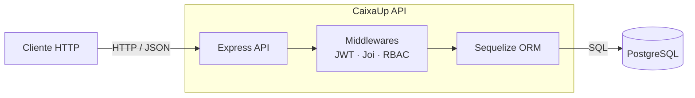
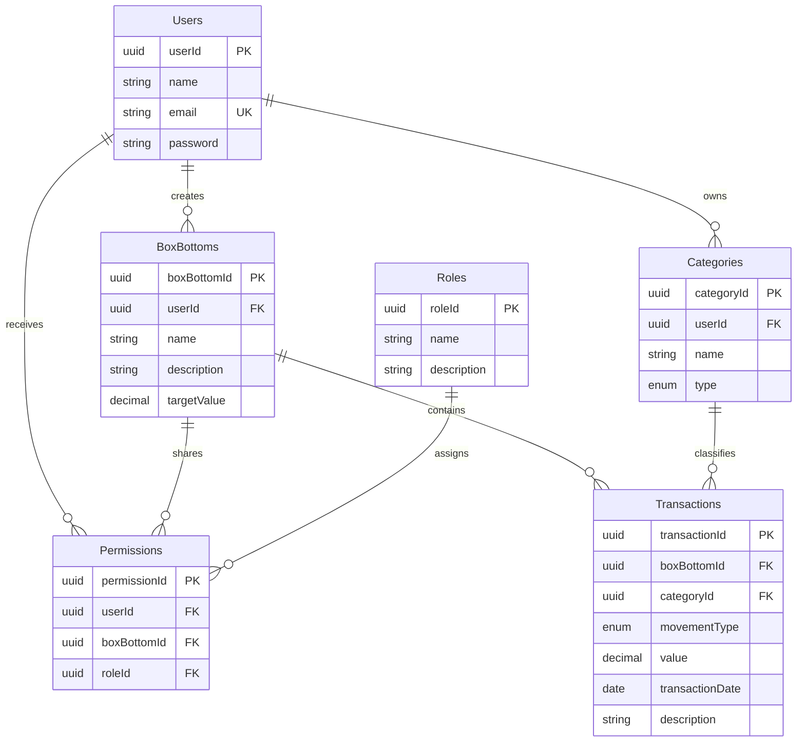

# CaixaUp


API REST para gestão financeira colaborativa por caixinhas, categorias e transações.  
Controle de acesso baseado em papéis (RBAC), com autenticação JWT e persistência PostgreSQL.

## Visão geral e arquitetura

CaixaUp é uma API backend em Node.js e TypeScript. O Express recebe requisições HTTP, valida entradas com Joi, autentica usuários com JWT e coordena operações de negócio persistidas pelo Sequelize no PostgreSQL. A autorização de acesso às caixinhas usa papéis associados por permissões.



As rotas e os contratos estão descritos em [openapi.yaml](./openapi.yaml). A visão detalhada de contêineres e componentes está em [docs/architecture/C4-Containers.md](./docs/architecture/C4-Containers.md).

## Modelo de dados resumido

O modelo relacional implementado possui seis entidades centrais. `Permissions` representa a associação de usuários e papéis a cada caixinha.



## Pré-requisitos

| Dependência    | Versão / requisito                  |
| -------------- | ----------------------------------- |
| Node.js        | 18 ou superior                      |
| npm            | Incluído com Node.js                |
| Docker Engine  | Instalado e em execução             |
| Docker Compose | Plugin `docker compose`             |
| PostgreSQL     | 16; pode ser executado pelo Compose |

## Quickstart

1. Configure as variáveis do Compose no arquivo `.env` na raiz, conforme o [guia de ambiente e testes](./docs/how-to/setup-e-testes.md). Os valores do banco devem corresponder aos de `api/.env.development`. Use credenciais locais e não as publique.
2. Na raiz do repositório, suba os serviços:

   ```bash
   docker compose up -d
   ```

3. Instale as dependências necessárias para executar o CLI das migrações no host:

   ```bash
   (cd api && npm ci)
   ```

4. Aplique as migrações usando o banco local:

   ```bash
   cd api && npm run db:migrate
   ```

5. A API de desenvolvimento fica disponível em `http://localhost:3000`.

## Primeiro fluxo HTTP

O endpoint implementado para autenticação é `POST /auth/login` (não `/users/login`). Faça login com um usuário já cadastrado:

```bash
curl --request POST \
  --url http://localhost:3000/auth/login \
  --header 'Content-Type: application/json' \
  --data '{"email":"voce@example.com","password":"sua-senha"}'
```

Resposta `200 OK`:

```json
{
  "accessToken": "<JWT emitido pela API>"
}
```

Use o token retornado para criar uma caixinha (`POST /box-bottoms`):

```bash
curl --request POST \
  --url http://localhost:3000/box-bottoms \
  --header 'Content-Type: application/json' \
  --header 'Authorization: Bearer <accessToken>' \
  --data '{
    "name": "Reserva de emergência",
    "description": "Objetivo financeiro compartilhado",
    "targetValue": 5000
  }'
```

Resposta `201 Created`:

```json
{
  "message": "BoxBottom Reserva de emergência created successfully",
  "boxBottomId": "<UUID da caixinha>"
}
```

## Documentação adicional

- [Guia de ambiente, migrações e testes](./docs/how-to/setup-e-testes.md) — tutorial para desenvolvimento e validação local.
- [Arquitetura C4 — contêineres](./docs/architecture/C4-Containers.md) — contêineres e componentes da aplicação.
- [ADR 0001 — migração para Permissions](./docs/adrs/0001-migracao-permissions.md) — registro da decisão de modelagem.
- [Relatórios históricos v4 e v5](./docs/reports/) — resultados arquivados de validação.
- [OpenAPI 3.0](./openapi.yaml) — referência de endpoints, autenticação e payloads.
