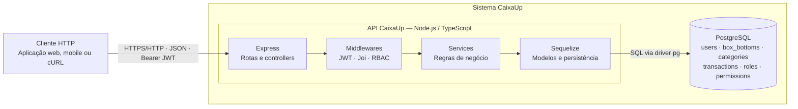

# Arquitetura C4 — contêineres

## Escopo

Este documento descreve o nível 2 do modelo C4 do CaixaUp e os principais componentes internos que implementam o fluxo de uma requisição. A visão de produto e o resumo do fluxo estão no [README](../../README.md).

## Diagrama de contêineres

## Contêineres e responsabilidades

| Contêiner        | Tecnologia                        | Responsabilidade                                                                                                          |
| ---------------- | --------------------------------- | ------------------------------------------------------------------------------------------------------------------------- |
| Cliente HTTP     | Cliente externo                   | Envia requisições JSON e, em rotas protegidas, apresenta o token Bearer.                                                  |
| CaixaUp API      | Node.js 18+, TypeScript e Express | Expõe as rotas REST, valida e autentica requisições e aplica as regras de negócio.                                        |
| Persistência ORM | Sequelize 6                       | Mapeia modelos, associações e migrações para operações SQL. É parte do contêiner da API, não um serviço de rede separado. |
| Banco de dados   | PostgreSQL                        | Armazena usuários, caixinhas, categorias, transações, papéis e permissões.                                                |

## Componentes da API

- **Rotas e controllers:** conectam os caminhos HTTP aos serviços e definem o formato das respostas.
- **`checkAuth`:** verifica o token JWT enviado no cabeçalho `Authorization` e associa a identidade autenticada à requisição.
- **`validateRequest` (Joi):** valida parâmetros e corpos de requisição conforme os schemas de cada rota.
- **`checkRole`:** confere se o usuário tem o papel exigido na caixinha indicada pela rota. Os papéis usados pelas rotas são `OWNER`, `MANAGER`, `EDITOR`, `CONTRIBUTOR`, `ANALYST` e `VIEWER`.
- **Services:** implementam operações sobre usuários, permissões, caixinhas, categorias, papéis e transações.
- **Modelos Sequelize:** mapeiam as seis entidades persistidas e suas associações.
- **`errorHandler`:** converte erros de validação e de aplicação em respostas HTTP JSON.

## Fluxo de requisição protegida

1. O cliente envia JSON e um token no formato `Authorization: Bearer <token>`.
2. Express despacha a rota; `checkAuth` verifica a assinatura e a validade do token.
3. O middleware Joi valida os parâmetros ou o corpo. Rotas de caixinha também podem exigir um dos papéis associados ao usuário.
4. O controller delega a operação ao service, que usa Sequelize para consultar ou modificar o PostgreSQL.
5. A API devolve a resposta JSON e o status HTTP correspondente.

Os caminhos, esquemas de entrada e respostas estão na [especificação OpenAPI](../../openapi.yaml).
