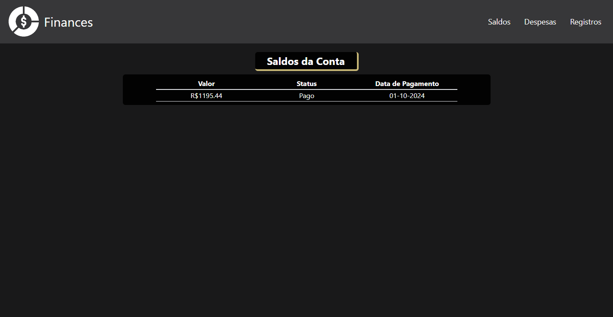
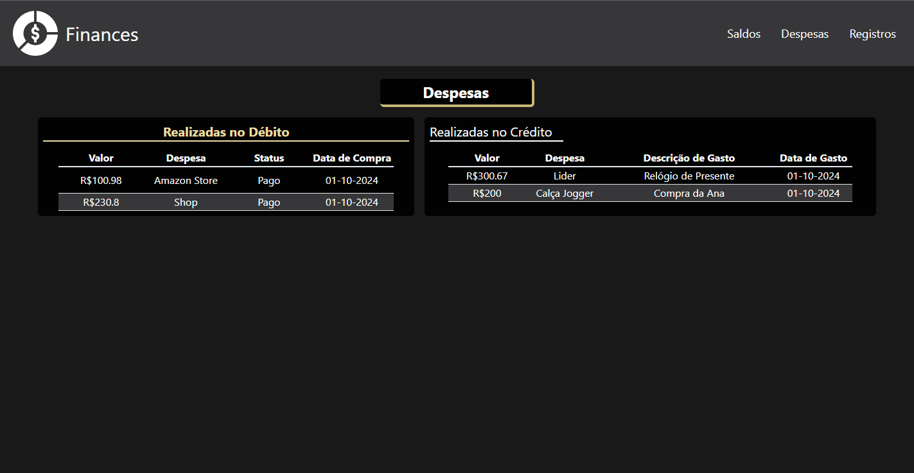
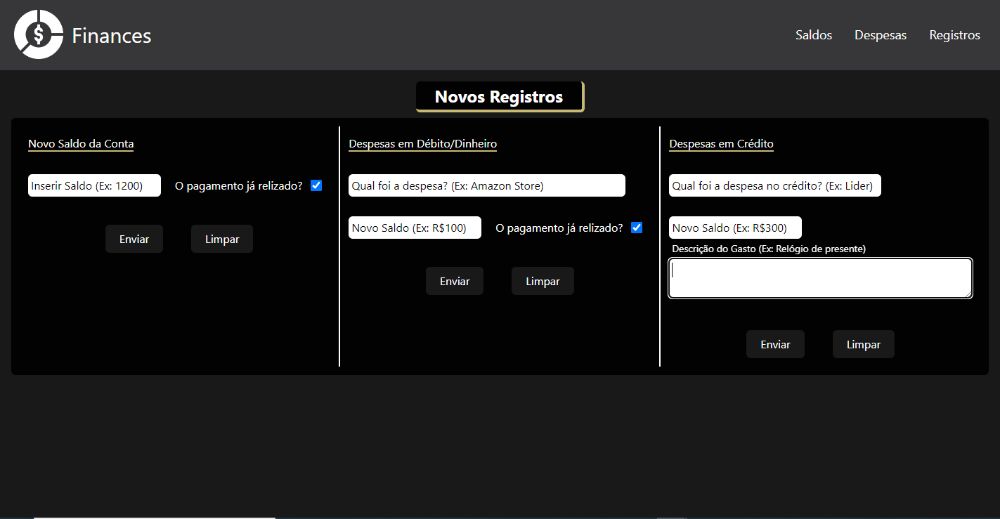

# 💸 Projeto Fullstack - Finances 💸

Este projeto é uma **aplicação web de gestão financeira** que proporciona uma maneira simples e eficiente de controlar suas finanças pessoais. Com ela, você pode inserir receitas e despesas, visualizar relatórios claros sobre seus gastos e saldo, além de fazer alterações nos dados conforme necessário. É a ferramenta ideal para manter suas finanças organizadas e tomar decisões mais informadas sobre o seu dinheiro! 💼💰

# 📚 Índice

- <a href="#tecnologias-utilizadas">🚀 Tecnologias Utilizadas</a>
- <a href="#endpoints">🔗 Endpoints</a>
- <a href="#pre-visualizacao-aplicacao">🖼️ Pré-visualização da Aplicação</a>
- <a href="#instalacao">📦 Instalação</a>
- <a href="#️como-executar-o-projeto">🛠️ Como Executar o Projeto</a>
- <a href="#funcionalidades-do-projeto">🎯 Funcionalidades do Projeto</a>
- <a href="#layout-responsivo">🎨 Layout Responsivo</a>
- <a href="#banco-de-dados">📊 Banco de Dados</a>
- <a href="#melhoria-contínua">📈 Melhoria Contínua</a>
- <a href="#conclusão">📋 Conclusão</a>

---

# <p id="tecnologias-utilizadas">🚀 Tecnologias Utilizadas</p>

## Backend (Node.js + TypeScript) 🛠️

- **cors**: Middleware para habilitar CORS (Cross-Origin Resource Sharing) no servidor.
- **dotenv**: Gerencia variáveis de ambiente para configuração segura.
- **express**: Framework web minimalista para criar APIs e servidores.
- **mysql2**: Cliente MySQL para conexão e execução de consultas SQL.
- **@types/cors**: Tipagens TypeScript para o pacote CORS.
- **@types/express**: Tipagens TypeScript para o Express.
- **nodemon**: Ferramenta que reinicia automaticamente o servidor durante o desenvolvimento.
- **ts-node-dev**: Executa e reinicia código TypeScript automaticamente no ambiente de desenvolvimento.
- **typescript**: Suporte para a linguagem TypeScript no desenvolvimento do backend.

## Frontend (React.js + TypeScript) 🎨

- **axios**: Cliente HTTP para fazer requisições a APIs.
- **react**: Biblioteca JavaScript para construção de interfaces de usuário interativas.
- **react-dom**: Pacote que lida com a renderização do React no DOM.
- **react-router-dom**: Biblioteca para gerenciamento de rotas no React.
- **@eslint/js**: Ferramenta de análise estática para identificar e corrigir problemas no código.
- **@types/react**: Tipagens TypeScript para o React.
- **@types/react-dom**: Tipagens TypeScript para o React DOM.
- **@vitejs/plugin-react**: Integração do Vite com React para uma construção mais rápida.
- **eslint**: Ferramenta de linting para garantir a qualidade e a consistência do código.
- **eslint-plugin-react-hooks**: Plugin ESLint para garantir boas práticas no uso de hooks do React.
- **eslint-plugin-react-refresh**: Plugin para melhorar a experiência de desenvolvimento no React com recarregamento automático.
- **globals**: Mapeia variáveis globais, auxiliando na verificação de código.
- **tailwindcss**: Framework CSS utilitário para estilização rápida e responsiva.
- **typescript**: Suporte para a linguagem TypeScript no desenvolvimento do frontend.
- **typescript-eslint**: Integração do ESLint com TypeScript para garantir boas práticas de código.
- **vite**: Ferramenta de build rápida para desenvolvimento de aplicações frontend modernas.

---

# <p id="endpoints">🔗 Endpoints</p>

## Inserção de dados financeiros:

1. `POST /balances` - Inserir saldo do usuário.
2. `POST /balances/expenses` - Inserir uma despesa em dinheiro/débito.
3. `POST /balances/credit` - Inserir uma despesa de crédito.

## Visualização de dados do usuário:

1. `GET /balances` - Retorna todos os saldos do usuário.
2. `GET /balances/expenses` - Retorna despesas realizadas em dinheiro/débito.
3. `GET /balances/credit` - Retorna despesas realizadas no crédito.

---

# <p id="funcionalidades-do-projeto">🎯 Funcionalidades do Projeto</p>

- **Cadastro de Receitas e Despesas**: Adicione suas receitas e despesas em diferentes categorias, como dinheiro/débito ou crédito, para ter um controle completo sobre suas finanças.
- **Relatórios Financeiros**: Visualize relatórios detalhados e gráficos claros sobre suas transações, ajudando a identificar seus principais gastos e a planejar melhor o orçamento.
- **Atualização de Dados**: Edite ou exclua entradas de saldo e despesas sempre que necessário, garantindo que seus registros financeiros estejam sempre atualizados.
- **Interface Amigável**: A interface foi desenvolvida utilizando React.js com Tailwind CSS, proporcionando uma experiência moderna e fácil de navegar.

---

# <p id="pre-visualizacao-aplicacao">🖼️ Pré-visualização da Aplicação</p>







---

# <p id="requisitos">⚙️ Requisitos</p>

---

# <p id="instalacao">📦 Instalação</p>

Siga estas etapas para configurar o ambiente local:

```bash
# Clone o repositório
git clone https://github.com/usuario/blog-pensamentos.git

# Acesse o diretório
cd blog-pensamentos

# Instale as dependências
npm install
```

---

# <p id="configuracao">🔧 Configuração</p>

Configure as variáveis de ambiente criando um arquivo .env na raiz do projeto com o seguinte conteúdo:

```bash
DB_HOST=localhost
DB_PORT=27017
DB_NAME=blog
JWT_SECRET=sua_chave_secreta
```

---

# <p id="#como-executar-o-projeto">🛠️ Como Executar o Projeto</p>

```bash
npm run dev - inicia o servidor

npm run build - compila código para Javascript

npm run tailwind - inicia o tailwind
```

O servidor estará disponível em http://localhost:3000

---

# <p id="layout-responsivo">🎨 Layout Responsivo</p>

O frontend da aplicação é totalmente responsivo, adaptando-se para funcionar perfeitamente em dispositivos móveis, tablets e desktops, oferecendo uma experiência de usuário consistente em qualquer tamanho de tela. 📱💻

---

# <p id="banco-de-dados">📊 Banco de Dados</p>

O projeto utiliza o **MySQL** como banco de dados relacional, garantindo segurança e performance no armazenamento e recuperação de informações financeiras. O MySQL foi escolhido pela sua escalabilidade e pela facilidade de integração com a arquitetura escolhida. O esquema de dados foi projetado para garantir consultas rápidas e atualizações eficientes. 🗄️

---

# <p id="melhoria-contínua">📈 Melhoria Contínua</p>

Este projeto foi pensado para facilitar a vida financeira dos usuários e está em constante evolução. Futuras melhorias incluem:

- **Categorias personalizadas** para que os usuários possam categorizar suas despesas e receitas conforme suas necessidades.
- **Notificações automáticas** que alertam sobre o vencimento de contas ou o limite de gastos.

---

# <p id="conclusão">📋 Conclusão</p>

Este projeto de gestão financeira combina a robustez do **Node.js** no backend com a eficiência do **React.js** no frontend, proporcionando uma solução completa e intuitiva para o controle de finanças pessoais. O uso de **TypeScript** em ambas as camadas garante um código mais seguro e legível, enquanto ferramentas como **Tailwind CSS** ajudam a entregar uma interface visualmente atraente e responsiva.

Quer se organizar financeiramente? Esse é o aplicativo certo para você! 💡💼

Agradeço por conferir o projeto! 💻🚀
